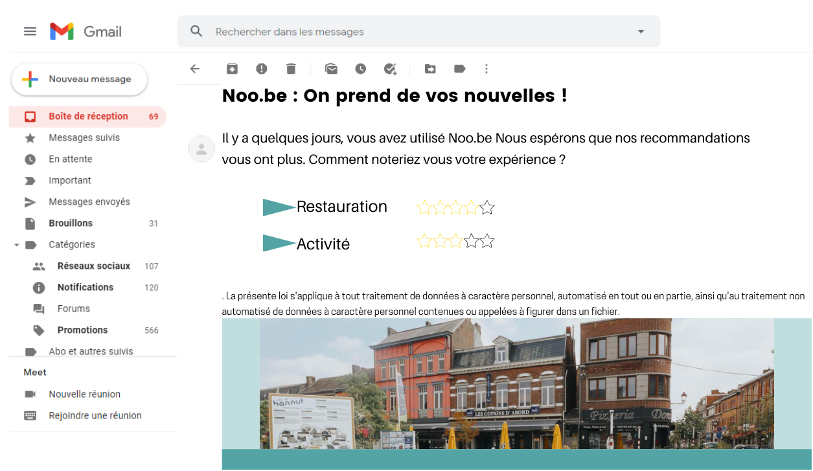

# HackYourCity-8

## Titre du challenge :
Dec’ Ouvrir ma commune

## Administration :
> Marche-en-Famenne (17.500 habitants) /Hannut (16.500 habitants)

- Sur mon territoire / dans mon administration, nous avons le problème suivant :
Hannut et Marche-en-Famenne sont des villes avec beaucoup de similitudes et nous avons décidé de proposer un challenge commun. Il est
difficile de maintenir l’attractivité de nos villes et plus particulièrement du centre-ville en restant centré uniquement sur le commerce. Nous
souhaitons pouvoir offrir une experience sur mesure aux personnes qui veulent découvrir nos communes que ce soit via le shopping, les loisirs,
l’Horeca, les promenades, les lieux insolites et cachés.
Nous souhaitons augmenter l’attractivité de nos communes grâce à des propositions sur-mesure en fonction du profil (famille avec enfants en
bas âge, couple, sportif, nouvel habitant…) et du temps que les visiteurs ont a passer dans celles-ci (2h, ½ journée, 1 journée…).
En un seul clic, l’utilisateur aurait accès à une proposition en fonction de son profil, ses envies, des événements et de la météo.
Cette application pourrait être replicable à n’importe quelle commune.

- Je pense que ces groupes de personnes sont concernés :
1. Touristes
2. Nouveaux habitants

------------------------------
## Noo.be 

...est un site internet proposant à un visiteur, ou un habitant de Marche-en-Famenne ou d'Hannut, un programme pour une journée.
Ce programme proposé sera basé sur des choix rapides de l'utilisateur quant à ses centres d'intérêt, sa situation familiale, la météo et d'autres critères.

### Prototype:

> Route implémentée pour la démonstration
Chemin utilisateur sur le site : Choix d'une personna > activité physique > en extérieur > avec du monde : Retourne une série d'évènement disponible dans la commune. Ici les festivals.

# A terme,
d'autres paramètres et choix seraient implémentables facilement. Que ce soit pour d'autres activités, ou d'autres villes.

- Un profil utilisateur :
1. Regroupant les dernières activités faites.
2. Ses favoris

- Un mail de feedback :
1. Pour une amélioration des recommandations
2. Pour des informations utiles pour la ville quant aux préférences de leurs visiteurs.



- Donnée météo et date:
1. Pour encore plus de précision dans les recommandations.

# Code :

```
pip install -r requirements.txt
```

```
py wsgy.y
```

